# section 4. API 개발 고급 - 컬렉션 조회 최적화

컬렉션 조회 → 일대다 관계 

ex) `일` : 데이터 1개 / `다` : 데이터 3개 → `일` 쪽에 데이터가 2개 뻥튀기 됨.

그래서 최적화 하기 어려워 짐. 

(XToOne때는 fetch join으로 한번에 가져왔고, db입장에서 성능상의 큰 문제도 없었음, 근데 컬렉션 조회는 db입장에서 데이터 뻥튀기가 되면서 성능상 고려해야할 포인트가 늘어남.)

예를들어 주문 1개에 주문 아이템이 3개 딸려있을때, 최종적으로 join하면 3줄이 되고, 주문1개 데이터가 중복으로 3개 들어가면서 데이터가 뻥튀기가 됨. 

→ 성능상으로 고민해야할 포인트가 많이 생기게 됨. ⇒ `컬렉션 최적화!`

# 1. 주문 조회 V1: 엔티티 직접 노출

```java
@GetMapping("/api/v1/orders")
public List<Order> ordersV1() {
	List<Order> all = orderRepository.findAllByString(new OrderSearch());
	for (Order order : all) {
		// Lazy 강제 초기화 (주문멤버, 주문주소, 주문아이템 -> 강제 초기화)
		order.getMember().getName();
		order.getDelivery().getAddress();
		List<OrderItem> orderItems = order.getOrderItems();
		orderItems.stream().forEach(o -> o.getItem().getName());
	}
	return all;
}
```

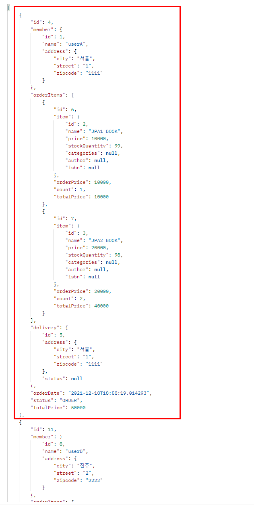

이렇게 강제초기화 한 값들을 출력한다.

→ 그냥 One 조회할 때랑 크게 달라진게 없음

# 2. 주문 조회 V2: 엔티티를 DTO로 변환

```java
@GetMapping("/api/v2/orders")
public List<OrderDto> ordersV2() {
	List<Order> orders = orderRepository.findAllByString(new OrderSearch());
	List<OrderDto> collect = orders.stream()
		.map(o -> new OrderDto(o))
		.collect(Collectors.toList());

	return collect;
}

@Getter
static class OrderDto {

	private Long orderId;
	private String name;
	private LocalDateTime orderDate;
	private OrderStatus orderStatus;
	private Address address;
	private List<OrderItem> orderItems;

	public OrderDto(Order order) {
		orderId = order.getId();
		name = order.getMember().getName();
		orderDate = order.getOrderDate();
		orderStatus = order.getStatus();
		address = order.getDelivery().getAddress();
		orderItems = order.getOrderItems();
	}
}
```

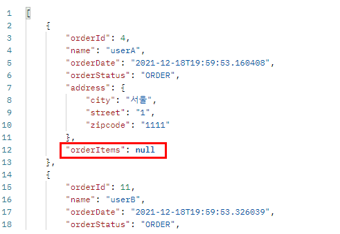

dto 클래스를 만들고 출력하면 orderItems만 null이 나옴 → entity이고, lazy loading이기 때문.

```java
public OrderDto(Order order) {
		orderId = order.getId();
		name = order.getMember().getName();
		orderDate = order.getOrderDate();
		orderStatus = order.getStatus();
		address = order.getDelivery().getAddress();
		// 추가 (lazy 로딩 강제 초기화)
		order.getOrderItems().stream().forEach(o -> o.getItem().getName());
		orderItems = order.getOrderItems();
	}
```

이렇게 강제 초기화 하면

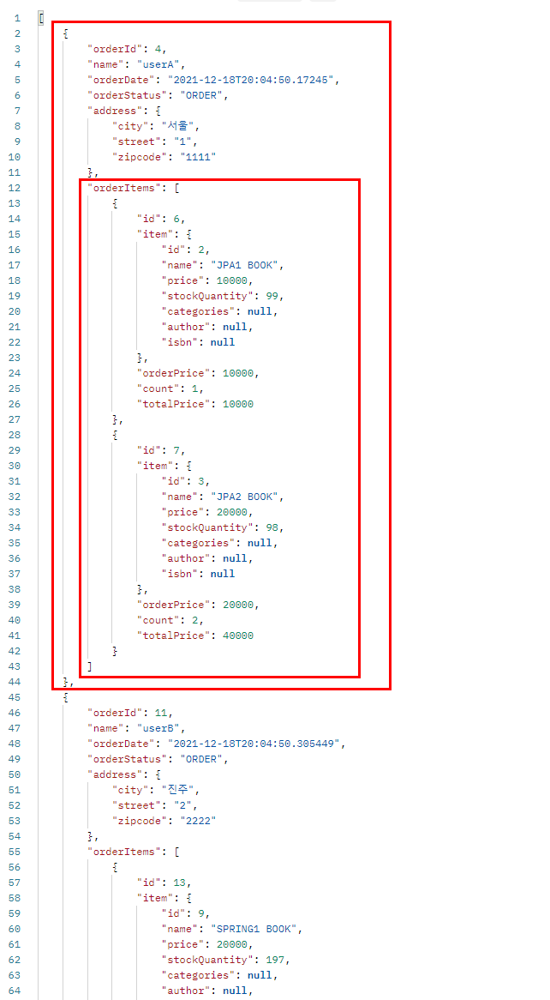

orderItems와 items까지 잘 나온다.

여기까지 하면

OrderDto로 반환하고 잘 한것 같지만, Dto안에 OrderItem엔티티가 있음. → 엔티티를 wrapping하는 것도 안됨. → 래핑을 해도 api 스펙상으로는 결국 안에있는 엔티티가 노출되게 됨.

→ 결국 위의 설계는 문제가 있음. `완전히 엔티티에 대한 의존을 끊어야 함`

안에있는 OrderItem 조차도 다 Dto로 바꿔야 한다.

```java
@Getter
static class OrderDto {

	private Long orderId;
	private String name;
	private LocalDateTime orderDate;
	private OrderStatus orderStatus;
	private Address address;
	private List<OrderItemDto> orderItems;

	public OrderDto(Order order) {
		orderId = order.getId();
		name = order.getMember().getName();
		orderDate = order.getOrderDate();
		orderStatus = order.getStatus();
		address = order.getDelivery().getAddress();
		orderItems = order.getOrderItems().stream()
			.map(orderItem -> new OrderItemDto(orderItem))
			.collect(Collectors.toList());
	}
}

@Getter
static class OrderItemDto {

	private String itemName; // 상품 명
	private int orderPrice; // 주문 가격
	private int count; // 주문 수량

	public OrderItemDto(OrderItem orderItem) {
		itemName = orderItem.getItem().getName();
		orderPrice = orderItem.getOrderPrice();
		count = orderItem.getCount();
	}
}
```

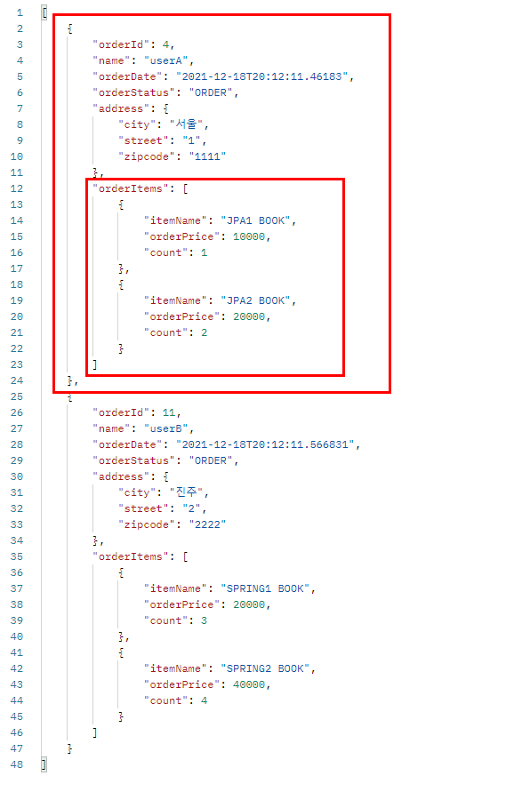

이렇게 OrderItem에서도 필요한 값들만 생성자로 받아서 api 스펙을 설계할 수 있음.

(단, Address 같은 value object는 외부에 노출해도 괜찮음 → 바뀔 일이 거의 없기 때문)

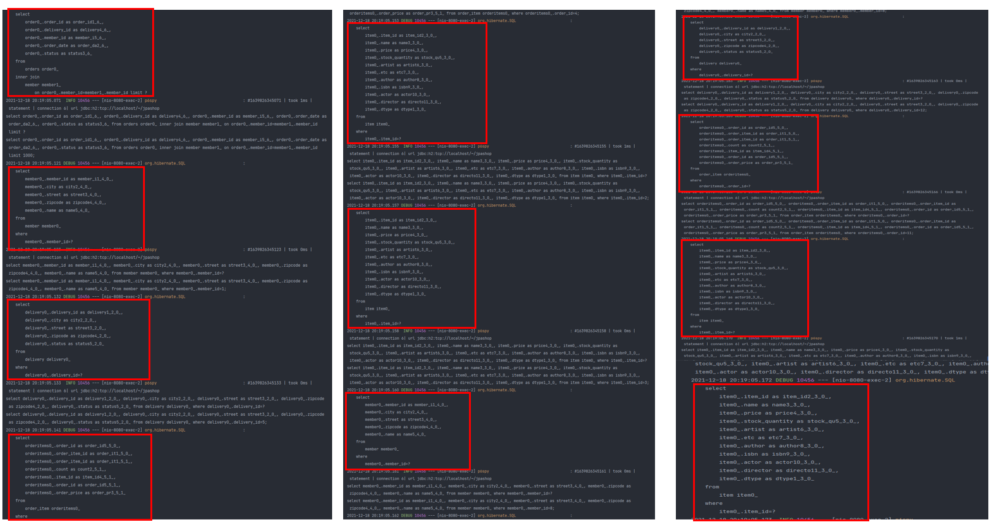

근데 쿼리가 11번 나감. (지연 로딩 때문)

order 조회 1번 → member + delivery 조회 2번 (총 4번) → orderItem 조회 2번 → item 조회 4번

1 + 4 + 2 + 4 ⇒ 11번..

`일`을 조회했을때 N+1 문제가 발생했는데, 컬렉션까지 조회가 되면 쿼리가 더많이 나감..

→ 성능 최적화에 더 고민을 해야 함.

이렇게 쿼리가 많이 나가면 admin 페이지가 아닌이상, 실시간 서비스에서 문제가 발생함.

→ `위와같은 컬렉션의 경우도 **페치 조인**으로 해결할 수 있음.` 

근데 컬렉션이 아닐때의 페치 조인은 되게 심플한데, 컬렉션일때의 페치 조인은 고민해야할 포인트가 좀 더 있음.

# 3. 주문 조회 V3: 엔티티를 DTO로 변환 - 페치 조인 최적화

```java
@GetMapping("/api/v3/orders")
public List<OrderDto> ordersV3() {
	List<Order> orders = orderRepository.findAllWithItem();
	List<OrderDto> result = orders.stream()
		.map(o -> new OrderDto(o))
		.collect(Collectors.toList());

	return result;
}
```

```java
public List<Order> findAllWithItem() {
	return em.createQuery(
		"select o from Order o" +
			" join fetch o.member m" +
			" join fetch o.delivery d" +
			" join fetch o.orderItems oi" +
			" join fetch oi.item i", Order.class
	).getResultList();
}
```

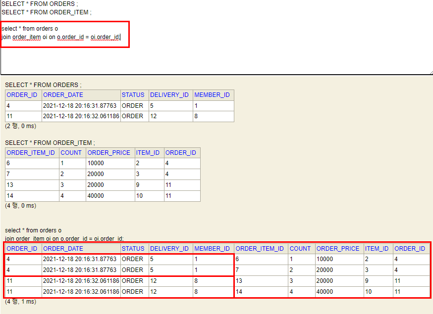

RDB에서 order_id가 같을때 join하면 위 처럼 테이블 형태로 만들어 내야함.

그래서 위와 같이 order 데이터가 2개씩 뻥튀기 됨.

이렇게 되면 JPA에서 order를 가져올 때 데이터가 orderitem 갯수배가 됨..


실제로 api response도 데이터가 2배가 되서 보냄..

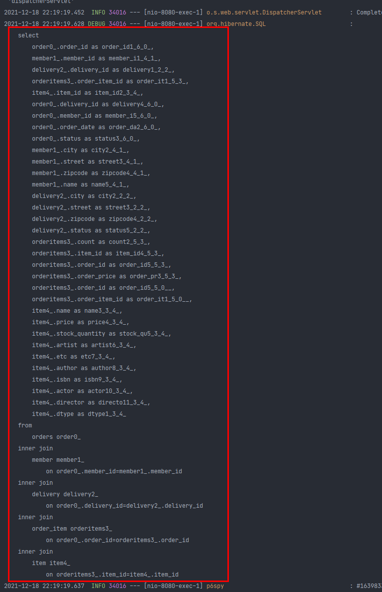

JPA가 날린 한방 쿼리를 그대로 실행해 보면

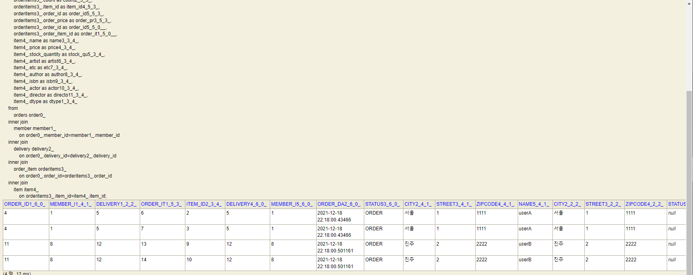

Order 자체가 2배로 뻥튀기 된 것을 볼 수 있다.

db 입장에서 join 해버리면 `일` 대 `다` 에서 `다` 의 갯수만큼 데이터가 뻥튀기 된다.

결국 우리가 의도했던 쿼리와 다른 결과가 나오게 됨.

hibernate는 

```sql
select o from Order o 
	join fetch o.member m
	join fetch o.delivery d
	join fetch o.orderItems oi
	join fetch oi.item i
```

이렇게 JPQL을 사용하여 fetch join했을때 db입장에서 데이터를 뻥튀기 해야할지, 명확한 기준을 알려주지 않으면 모른다.

우리가 원하는건 order에 대해서는 데이터를 뻥튀기 하고 싶지 않음.

위 jpql에서 o가 4개 인걸 원하지 않고 2개 이길 원한다.

```sql
@GetMapping("/api/v3/orders")
	public List<OrderDto> ordersV3() {
		List<Order> orders = orderRepository.findAllWithItem();
		for (Order order : orders) {
			System.out.println("order ref=" + order + " id=" + order.getId());
		}

		List<OrderDto> result = orders.stream()
			.map(o -> new OrderDto(o))
			.collect(Collectors.toList());

		return result;
	}
```


실제로 데이터 4개를 받아오고, ref도 중복된걸 가져온다.

```sql
select distinct o from Order o 
	join fetch o.member m
	join fetch o.delivery d
	join fetch o.orderItems oi
	join fetch oi.item i
```

2개만 받고싶다면 `distinct` 라는 키워드를 넣어주면 db의 distinct 역할을 해준다. 그리고 db의 distinct 외에도 한가지를 추가로 더 해준다.


원하는대로 딱 2개만 나온다.

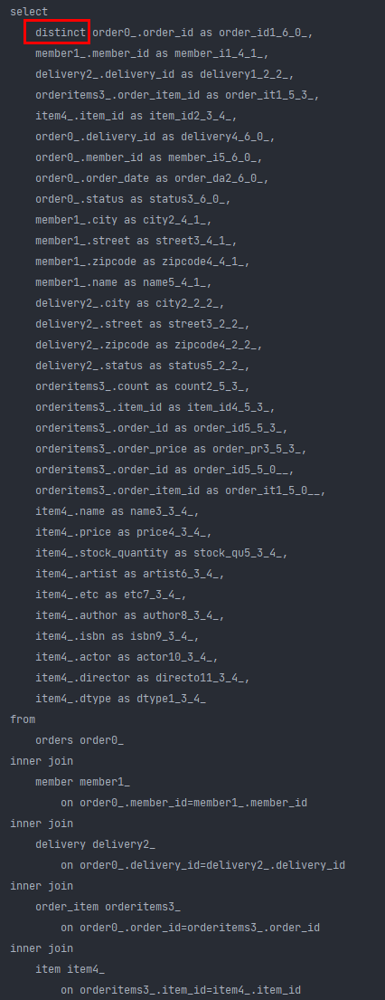

실제 쿼리도 sql distinct를 넣어서 날려준다.

근데 문제가 있는데, 데이터베이스의 distinct는 정말로 한 줄이 전부 다 똑같아야 중복 제거가 된다.

근데 order 정보는 같아도 orderItem 정보는 다르기 때문에 중복제거를 할 수가 없다.

→ 즉, 지금과 같은 상황에서는 db 쿼리에서는 distinct가 적용되지 않는다. 

근데 jpa에서 자체적으로 distinct가 있으면 order를 가져올때 id가 같은 값이 있으면 중복된 값을 제거하고 하나만 가져온다. 그렇게 List에 넣어서 반환해 준다.

**즉, 일단 애플리케이션에 데이터를 다 가져와서 order의 객체 id가 똑같은지 확인하고 중복된 것들은 객체에서 제외시키고 컬렉션에 담을때 하나만 반환시켜준다.**


결과적으로 order id가 중복없이, orderitem을 여러개 가져올 수 있게 된다.


`distinct 의 기능`

1. DB의 distinct 키워드를 붙여줌
2. root 엔티티가 중복인 경우, 중복을 걸러서 컬렉션에 담아준다.

V3 버전을 통해서 결국 쿼리가 11개 나가던 것을 1번의 쿼리로 해결할 수 있다.

근데 **단점**이 있다.

일대다 조인의 경우는 **페이징이 불가능** 하다. 

일대다 페치조인을 하는순간, 페이징 쿼리가 나가지 않는다.

```sql
public List<Order> findAllWithItem() {
	return em.createQuery(
		"select distinct o from Order o" +
			" join fetch o.member m" +
			" join fetch o.delivery d" +
			" join fetch o.orderItems oi" +
			" join fetch oi.item i", Order.class)
		.setFirstResult(1)
		.setMaxResults(100)
		.getResultList();
}
```

페이징 쿼리를 위해 setFirstResult, setMaxResults로 페이지 1부터 100개를 가져오게 셋팅함.

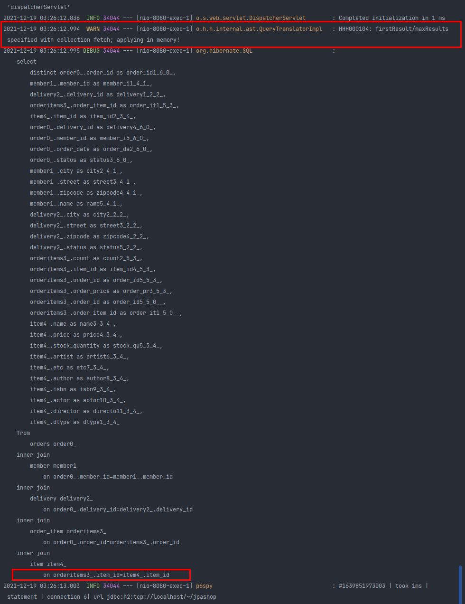

근데 쿼리에 limit, offset이 쿼리에 없다.

그리고 warning 로그가 있는데, firstResult, maxResults(페이징 쿼리)가 collection fetch 조인과 같이 정의 되었기 때문에 **메모리에서 페이징 처리**를 한다는 뜻이다.

데이터가 만약 10000개가 있었다면 10000개를 애플리케이션에 다 퍼올린 다음에 `메모리`에서 페이징 처리를 한다.

이렇게 되면 **out of memory**가 발생할 가능성이 높아진다. 이런 쿼리가 몇개 더 들어오면 어플리케이션이 제대로 동작할 수 없다. (매우 위험하다)

**결론**

일대다 페치 조인에서는 페이징을 **사용할 수 없고**, **사용하려고 시도해도 안됨.**

> 참고 : 컬렉션 페치 조인은 1개만 사용할 수 있음.
> 

만약 2개 이상이라면 일대다의 다에서 또 일대다가 발생하게 되고, 데이터가 부정합하게 조회될 가능성이 높아진다. (데이터가 완전히 뻥튀기 되버림;)

그래서 row도 많아질 뿐만아니라, 이제 어떤 데이터를 가져와야 할지도 모르는 상황이 발생하게 된다.

> 페이징 안할꺼면 위에서 했던 것처럼 fetch join 잘 써서 한방쿼리 날리고 데이터 사용하면 된다.
> 

# 4. 주문 조회 V3.1: 엔티티를 DTO로 변환 - 페이징과 한계 돌파

- 컬렉션을 페치 조인하면 페이징이 불가능하다.
    - 컬렉션을 페치 조인하면 일대다 조인이 발생하므로 데이터가 예측할 수 없이 증가한다.
    - 일다대에서 `일(1)`을 기준으로 페이징을 하는 것이 목적이다. 그런데 데이터는 `다(N)`를 기준으로 row가 생성된다.
    - Order를 기준으로 페이징 하고 싶은데, 다(N)인 OrderItem을 조인하면 OrderItem이 기준이
    되어버린다.
    - (더 자세한 내용은 자바 ORM 표준 JPA 프로그래밍 - 페치 조인 한계 참조)
- 이 경우 하이버네이트는 경고 로그를 남기고 모든 DB 데이터를 읽어서 메모리에서 페이징을 시도한다. 최악의 경우 장애로 이어질 수 있다.

### 해결 방법

코드도 단순하고, 성능 최적화도 보장하는 매우 강력한 방법이 있음. → 대부분의 페이징 + 컬렉션 엔티티 조회 문제는 이 방법으로 해결할 수 있음.

- 먼저 **ToOne**(OneToOne, ManyToOne) 관계를 모두 페치조인 한다. ToOne 관계는 row수를 증가시키지 않으므로 페이징 쿼리에 영향을 주지 않는다.
- **컬렉션은 지연 로딩으로 조회한다.**
- 지연 로딩 성능 최적화를 위해 `hibernate.default_batch_fetch_size`, `@BatchSize`를 적용한다.
    - hibernate.default_batch_fetch_size : 글로벌 설정
    - @BatchSize : 개별 최적화
    - 이 옵션을 사용하면 컬렉션이나, 프록시 객체를 한꺼번에 설정한 size 만큼 IN 쿼리로 조회한다.
    

```sql
@GetMapping("/api/v3.1/orders")
public List<OrderDto> ordersV3_page() {
	List<Order> orders = orderRepository.findAllWithMemberDelivery();
	
	List<OrderDto> result = orders.stream()
		.map(o -> new OrderDto(o))
		.collect(Collectors.toList());

	return result;
}
```

```sql
public List<Order> findAllWithMemberDelivery() {
	return em.createQuery(
		"select o from Order o" +
			" join fetch o.member m" +
			" join fetch o.delivery d", Order.class
	).getResultList();
}
```

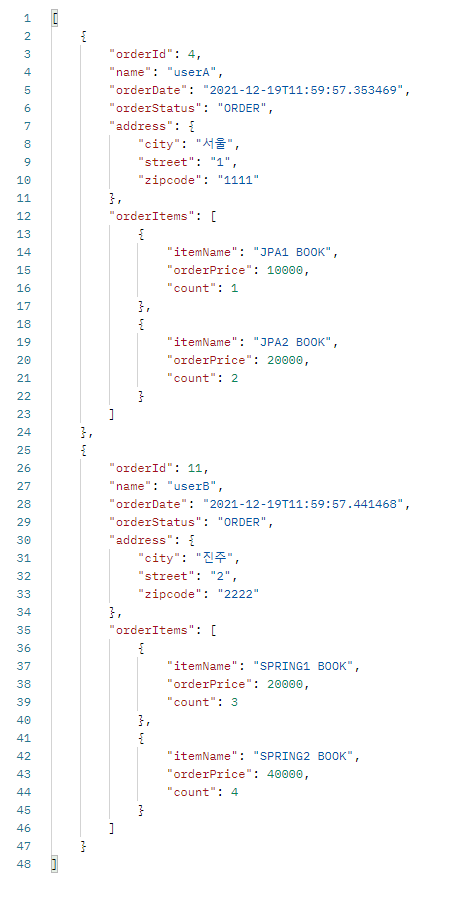

member와 delivery만 fetch join으로 가져오고, orderItem과 item은 지연로딩으로 가져오 면 결과는 잘 나온다.

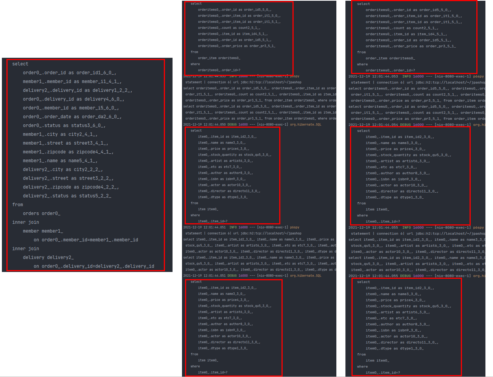

근데 쿼리는 order + member + delivery fetch join 쿼리 1번, orderItem 2번, Item 4번 ⇒ 총 7번의 쿼리가 나간다.

> 참고로 ToOne 페치조인 쿼리에서는 페이징 처리가 가능함.
> 

```sql
@GetMapping("/api/v3.1/orders")
public List<OrderDto> ordersV3_page(
	@RequestParam(value = "offset", defaultValue = "0") int offset,
	@RequestParam(value = "limit", defaultValue = "100") int limit
) {
	List<Order> orders = orderRepository.findAllWithMemberDelivery(offset, limit);

	List<OrderDto> result = orders.stream()
		.map(o -> new OrderDto(o))
		.collect(Collectors.toList());

	return result;
}
```

```sql
public List<Order> findAllWithMemberDelivery(int offset, int limit) {
	return em.createQuery(
		"select o from Order o" +
			" join fetch o.member m" +
			" join fetch o.delivery d", Order.class)
		.setFirstResult(offset)
		.setMaxResults(limit)
		.getResultList();
}
```

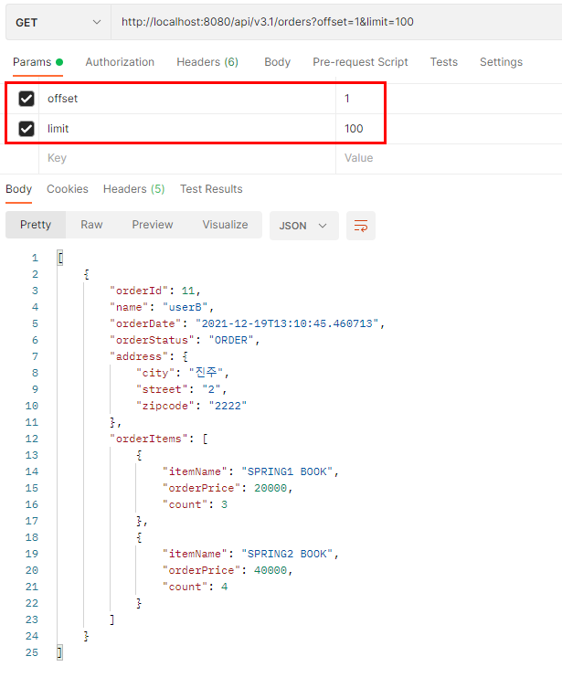

offset을 1로 해서 orderId가 4인거 빼고 11인게 나옴.

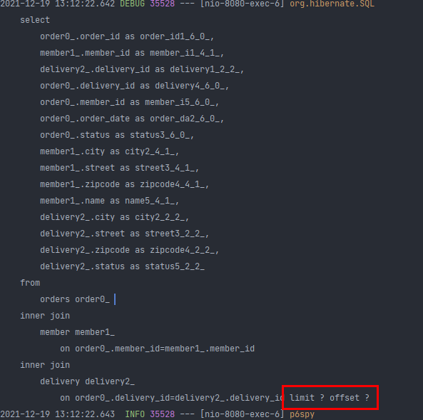

order + member + delivery를 가져오는 페치조인 쿼리에서 limit, offset 키워드로 페이징 쿼리가 나가는 것을 확인할 수 있다.

**이제 일대다 지연로딩 문제를 해결해보자.**

```yaml
spring:
  datasource:
    url: jdbc:h2:tcp://localhost/~/jpashop;
    username: sa
    password:
    driver-class-name: org.h2.Driver

  jpa:
    hibernate:
      ddl-auto: create
    properties:
      hibernate:
#        show_sql: true
        format_sql: true
        default_batch_fetch_size: 100 # default batc fetch size를 100으로 설정

logging:
  level:
    org.hibernate.SQL: debug
#    org.hibernate.type: trace
```

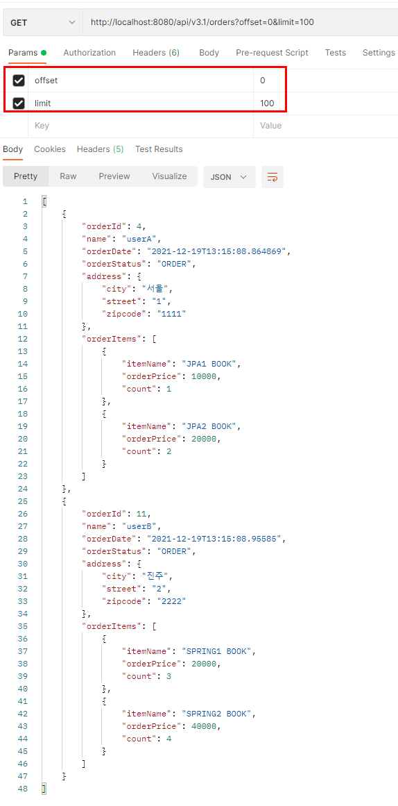

이번에는 데이터를 다 가져오기 위해 offset을 0으로 지정한다.


결론은 총 3개의 쿼리가 나간다.

참고로 offset이 0이면 hibernate가 offset 명령을 지움.

우선 order + member + delivery 페치조인 쿼리가 한번 나간다. 

그리고 두번째로 orderItem 루프를 돌면서 orderItem을 가져온다.


근데 쿼리를 잘보면 where 절에 `in 쿼리`가 들어감.

**한번에 in 쿼리로 userA에 있는 orderItems와 userB에 있는 orderItems를 in 쿼리 한방으로 가져와버린 거임.**

여기서 in 쿼리 갯수를 최대 100까지 잡은게 바로 `**default_batch_fetch_size**` 이다

item도 user당 2개씩 총 4개가 있었고, 지연 로딩때는 쿼리를 4번날렸는데, default batch fetch size를 지정하면 그 갯수만큼 한번에 in 쿼리로 가져온다.

그래서 만약 default batch fetch size가 100인데, item이 1000개 였다면 in쿼리 를 총 10번 날리게 된다.

**그리고 이 in 쿼리는 pk 기반으로 쿼리를 날리는 거기 때문에 인덱스가 걸려있어서 굉장히 성능 최적화 되어 빠르게 데이터를 가져올 수 있게 된다.**

→ **1 + N + N** 으로 쿼리를 날리던 것을 **1 + 1 + 1** 로 획기적으로 쿼리 갯수를 줄일 수 있게 됨.

이 정도로 쿼리 최적화가 된다면 우리가 원하는 만큼의 성능이 나옴.

> 진짜 고객에게 실시간 정보를 막 빠르게 줘야 한다면, 레디스, 캐시를 써야함.. 아니면 DB에 한줄 노멀라이징 해서 플랫하게 데이터 말아넣어 놓거나..
> 

물론 V3때는(전부 다 fetch join 걸었을 때) 쿼리를 딱 1번만 날리긴 했지만 db 입장에서는 데이터가 뻥튀기 되기 때문에 db에서 애플리케이션으로 데이터를 한꺼번에 날리게 됨 → 데이터 전송량 자체가 많아짐.

결국 쿼리는 1번 날리지만 데이터 용량이 늘어나게 됨.

근데 지금 처럼 default batch fetch size를 이용하면 쿼리는 3번 나가지만 db에서 데이터 중복없이 딱 필요한 것들만 조회한다. 그래서 db에서 애플리케이션으로 중복 없는 데이터를 전송하게 된다.

정규화 된 데이터를 가져오느냐, 정규화 되지 않은 데이터를 가져오지 않느냐의 차이다.

지금은 데이터가 굉장히 심플해서 뭔 차이가 있나 싶을 수 있는데 데이터가 1000개 이상넘어가면 확연히 차이가 나게 됨.

그래서 쿼리가 더 나가더라도 정규화된 데이터를 가져오는게 성능상 더 최적화된다고 볼 수 있다.

**물론 ToOne 관계도 fetch join 하지않고 default batch fetch size의 영향을 받고 in쿼리로 따로 가져올 수 도 있음. 근데 쿼리가 또 추가적으로 나가고, 네트워크를 추가적으로 타게 되니까, ToOne 관계는 fetch join으로 가져오는게 쿼리를 줄이고 좋다.**

**참고**

```yaml
spring:
  datasource:
    url: jdbc:h2:tcp://localhost/~/jpashop;
    username: sa
    password:
    driver-class-name: org.h2.Driver

  jpa:
    hibernate:
      ddl-auto: create
    properties:
      hibernate:
#        show_sql: true
        format_sql: true
        default_batch_fetch_size: 100

logging:
  level:
    org.hibernate.SQL: debug
#    org.hibernate.type: trace
```

yml에서 batch fetch size 설정은 global한 설정이다. 그래서 디테일하게 적용하고 싶으면 

```java
@Entity
@Table(name = "orders")
@Getter @Setter
@NoArgsConstructor(access = AccessLevel.PROTECTED)
public class Order {

	...

	@BatchSize(size = 1000)
	@OneToMany(mappedBy = "order", cascade = CascadeType.ALL)
	private List<OrderItem> orderItems = new ArrayList<>();

	...
}
```

해당 필드에 batch size를 정하면 된다. (컬렉션은 컬렉션 필드에, 엔티티는 엔티티 클래스에 적용)

근데 이렇게 디테일한 설정은 상황마다 다르기 때문에 애매하고, 글로벌하게 적용하는게 더 낫다.

### 정리

- 장점
    - 쿼리 호출 수가 1 + N → 1 + 1 로 최적화 된다.
    - 조인(데이터 중복)보다 db 데이터 전송량이 최적화 된다.
    - 페치 조인 방식과 비교하면 쿼리 호출 수가 약간 증가하지만, DB 데이터 전송량이 감소한다.
    - **컬렉션 페치 조인은 페이징이 불가능 하지만 이 방법은 페이징이 가능하다.**
- 결론
    - ToOne 관계는 페치 조인해도 페이징에 영향을 주지 않는다. 따라서 ToOne 관계는 페치 조인으로 쿼리 수를 줄이면서 해결하고, 나머지는 `hibernate.default_batch_fetch_size`로 최적화 하자.
    

> 참고: default_batch_fetch_size 의 크기는 적당한 사이즈를 골라야 하는데, 100~1000 사이를
선택하는 것을 권장한다. 이 전략을 SQL IN 절을 사용하는데, 데이터베이스에 따라 IN 절 파라미터를 1000으로 제한하기도 한다. 1000으로 잡으면 한번에 1000개를 DB에서 애플리케이션에 불러오므로 DB에 순간 부하가 증가할 수 있다. 하지만 애플리케이션은 100이든 1000이든 결국 전체 데이터를 로딩해야하므로 **(애플리케이션 로직상 결국 데이터를 다 루프를 돌며 가져오기 때문, db에서 페이징 쿼리를 해서 가져오면 그 데이터를 다 루프를 도는거지, 데이터베이스 데이터를 다 가져오고 애플리케이션 로직에서 페이징 하듯 갯수를 짤라서 조회하는게 아니기 때문!)** WAS 입장에서 메모리 사용량이 같다. 1000으로 설정하는 것이 성능상 가장 좋지만, 결국 DB든 애플리케이션이든 순간 부하를 어디까지 견딜 수 있는지로 결정하면 된다.
> 

# 5. 주문 조회 V4: JPA에서 DTO 직접 조회

```java
@GetMapping("/api/v4/orders")
public List<OrderQueryDto> ordersV4() {
	return orderQueryRepository.findOrderQueryDtos();
}
```

```java
@Repository
@RequiredArgsConstructor
public class OrderQueryRepository {
	private final EntityManager em;

	public List<OrderQueryDto> findOrderQueryDtos() {
		List<OrderQueryDto> result = findOrders();

		result.forEach(o -> {
			List<OrderItemQueryDto> orderItems = findOrderItems(o.getOrderId());
			o.setOrderItems(orderItems);
		});
		return result;
	}

	private List<OrderItemQueryDto> findOrderItems(Long orderId) {
		return em.createQuery(
			"select new jpabook.jpashop.repository.order.query.OrderItemQueryDto(oi.order.id, i.name, oi.orderPrice, oi.count)" + // oi.order.id 에서 사실 orderItem에 order_id fk가 있어서 참조를 하진 않음.
				" from OrderItem oi" +
				" join oi.item i" + // orderItem입장에서 item은 ToOne관계 이므로 join해도 데이터 뻥튀기 X
				" where oi.order.id = :orderId", OrderItemQueryDto.class)
			.setParameter("orderId", orderId)
			.getResultList();
	}

	private List<OrderQueryDto> findOrders() {
		return em.createQuery(
			"select new jpabook.jpashop.repository.order.query.OrderQueryDto(o.id, m.name, o.orderDate, o.status, d.address)" +
				" from Order o" +
				" join o.member m" +
				" join o.delivery d", OrderQueryDto.class)
			.getResultList();
	}
}
```

```java
@Data
public class OrderQueryDto {
	private Long orderId;
	private String name;
	private LocalDateTime orderDate;
	private OrderStatus orderStatus;
	private Address address;
	private List<OrderItemQueryDto> orderItems;

	public OrderQueryDto(Long orderId, String name, LocalDateTime orderDate, OrderStatus orderStatus,
		Address address) {
		this.orderId = orderId;
		this.name = name;
		this.orderDate = orderDate;
		this.orderStatus = orderStatus;
		this.address = address;
	}
}
```

```java
@Data
public class OrderItemQueryDto {

	@JsonIgnore
	private Long id;
	private String itemName;
	private int orderPrice;
	private int count;

	public OrderItemQueryDto(Long id, String itemName, int orderPrice, int count) {
		this.id = id;
		this.itemName = itemName;
		this.orderPrice = orderPrice;
		this.count = count;
	}
}
```

jpql에서 new 오퍼레이션으로 OrderQueryDto를 반환하게 만든다. 이때 orderItems는 컬렉션이므로 데이터를 플랫하게 집어넣을 수 없어서 생성자 파라미터에서 제외함.

> 참고 : 인텔리제이 f2 → 에러 라인으로 바로 이동
> 

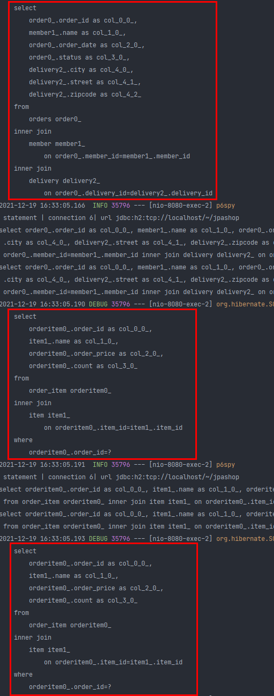

순서

ordersV4() → findOrderQueryDtos() → findOrders() (쿼리 1번) → findOrderItems() (쿼리 2번)

⇒ 총 3번의 쿼리가 나간다. (이거도 결과적으로 N+1 문제이다. OrderItem이 for루프를 돌면서 OrderItem이 N개면 N만큼 쿼리가 나가기 때문!)

# 6. 주문 조회 V5: JPA에서 DTO 직접 조회 - 컬렉션 조회 최적화

위의 N+1문제를 해보자.

```java
public List<OrderQueryDto> findAllByDto_optimization() {
		List<OrderQueryDto> result = findOrders();

		List<Long> orderIds = result.stream()
			.map(o -> o.getOrderId())
			.collect(Collectors.toList());

		List<OrderItemQueryDto> orderItems = em.createQuery(
			"select new jpabook.jpashop.repository.order.query.OrderItemQueryDto(oi.order.id, i.name, oi.orderPrice, oi.count)"
				+ // oi.order.id 에서 사실 orderItem에 order_id fk가 있어서 참조를 하진 않음.
				" from OrderItem oi" +
				" join oi.item i" +
				" where oi.order.id in :orderId", OrderItemQueryDto.class)
			.setParameter("orderId", orderIds)
			.getResultList();

		// 성능 최적화를 위해 List인 orderItems를 map으로 바꿔 준다.
		Map<Long, List<OrderItemQueryDto>> orderItemMap = orderItems.stream()
			.collect(Collectors.groupingBy(orderItemQueryDto -> orderItemQueryDto.getOrderId()));

		result.forEach(o -> o.setOrderItems(orderItemMap.get(o.getOrderId())));

		return result;
	}
```

for 루프 도는 대신 orderIds를 리스트로 만들어서 **`in 쿼리`**를 날린다.

그 다음 성능 최적화를 위해 orderItems를 map으로 바꿔서 메모리로 매칭시켜서 OrderQueryDto 리스트에 넣어준다. `O(1)`

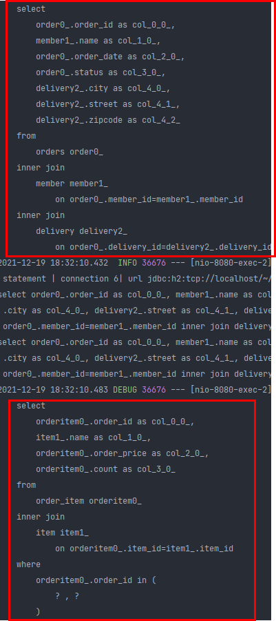

이렇게 되면 findOrders()에서 쿼리 1번, in 쿼리 1번 ⇒ 총 2번의 쿼리가 나가게 된다. 

# 7. 주문 조회 V6: JPA에서 DTO로 직접 조회, 플랫 데이터 최적화

위의 쿼리 2번을 1번으로 더 최적화 시킬 수 있음.

FlatDto를 만든다 → 진짜 얘는 db에서 데이터를 한번에 다 가져오는 거임. (order, orderitem을 join하고 orderitem이랑 item을 join하여 진짜 다 한방 쿼리로 가져온다)

```java
@Data
public class OrderFlatDto {
	private Long orderId;
	private String name;
	private LocalDateTime orderDate;
	private OrderStatus orderStatus;
	private Address address;

	private String itemName;
	private int orderPrice;
	private int count;

	public OrderFlatDto(Long orderId, String name, LocalDateTime orderDate, OrderStatus orderStatus,
		Address address, String itemName, int orderPrice, int count) {
		this.orderId = orderId;
		this.name = name;
		this.orderDate = orderDate;
		this.orderStatus = orderStatus;
		this.address = address;
		this.itemName = itemName;
		this.orderPrice = orderPrice;
		this.count = count;
	}
}
```

sql join을 데이터를 한줄로 만든다. 한줄로 데이터를 flat하게 db에서 가져올 수 있도록 데이터 구조를 맞춰야 한다.

```java
@GetMapping("/api/v6/orders")
public List<OrderFlatDto> ordersV6() {
	return orderQueryRepository.findAllByDto_flat();
}
```

```java
public List<OrderFlatDto> findAllByDto_flat() {
	return em.createQuery(
		"select new jpabook.jpashop.repository.order.query.OrderFlatDto(o.id, m.name, o.orderDate, o.status, d.address, i.name, oi.orderPrice, oi.count)" +
			" from Order o" +
			" join o.member m" +
			" join o.delivery d" +
			" join o.orderItems oi" +
			" join oi.item i", OrderFlatDto.class)
		.getResultList();
}
```

이렇게 api 스펙을 OrderFlatDto로 내려주면

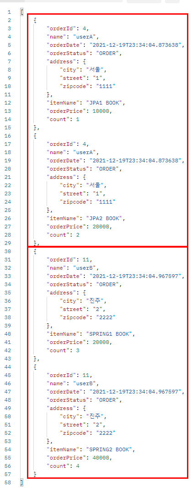

컬렉션 join이므로 데이터가 뻥튀기 된다.

V5의 API 스펙(OrderQueryDto)과 같이 내려주려면 내가 직접 중복을 걸러내면 된다. 

```java
@GetMapping("/api/v6/orders")
public List<OrderQueryDto> ordersV6() {
	List<OrderFlatDto> flats = orderQueryRepository.findAllByDto_flat();

	// flatDto를 QueryDto로 바꾸는 과정 (데이터 한줄로 받아와서 개발자가 직접 분해 조립하여 만든 코드임.)
	return flats.stream()
		.collect(groupingBy(o -> new OrderQueryDto(o.getOrderId(), o.getName(), o.getOrderDate(), o.getOrderStatus(), o.getAddress()),
			mapping(o -> new OrderItemQueryDto(o.getOrderId(), o.getItemName(), o.getOrderPrice(), o.getCount()), toList())
		)).entrySet().stream()
		.map(e -> new OrderQueryDto(e.getKey().getOrderId(), e.getKey().getName(), e.getKey().getOrderDate(), e.getKey().getOrderStatus(), e.getKey().getAddress(), e.getValue()))
		.collect(toList());
}
```


원하는 결과 (V5와 같은 API 스펙) 를 얻을 수 있다.

장점

- 쿼리 1번에 해결 가능.

단점 

- 쿼리는 한번이지만 조인으로 인해 DB에서 애플리케이션에 전달하는 데이터에 중복 데이터가 추가되므로 상황에 따라 V5 보다 더 느릴 수 있다.
- 중복 제거를 위해 애플리케이션에서 추가 작업이 크다.
- 페이징이 불가능하다. (order 기준으로 안됨. orderItem 기준으로 됨)

# 8. API 개발 고급 정리

- **엔티티 조회**
    - `V1` : 엔티티를 조회해서 그대로 반환
    - `V2` : 엔티티 조회 후 DTO로 변환
    - `V3` : 페치 조인으로 쿼리 수 최적화
    - `V3.1`  : 컬렉션 페이징과 한계 돌파
        - 컬렉션은 페치 조인 시 페이징이 불가능
        - ToOne관계는 페치 조인으로 쿼리 수 최적화
        - 컬렉션은 페치 조인 대신에 지연로딩을 유지하고 `hibernate.default_batch_fetch_size`, `@BatchSize`로 최적화

- **DTO 직접 조회**
    - `V4` : JPA에서 DTO를 직접 조회
    - `V5` : 컬렉션 조회 최적화 - 일대다 관계인 컬렉션은 IN 절을 활용해서 메모리에 미리 조회해서 최적화
    - `V6` : 플랫 데이터 최적화 - JOIN 결과를 그대로 조회 후 애플리케이션에서 원하는 모양으로 직접 변환
    

### 권장 순서

1. **엔티티 조회 방식**으로 우선 접근
    1. 페치조인으로 쿼리 수를 최적화
    2. 컬렉션 최적화
        1. 페이징 필요 `hibernate.default_batch_fetch_size`, `@BatchSize` 로 최적화
        2. 페이징 필요 X → 페치 조인 사용
2. 엔티티 조회 방식으로 해결이 안되면 **DTO 조회 방식** 사용
3. DTO 조회 방식으로 해결이 안되면 NativeSQL or 스프링 JdbcTemplate 사용

> 참고 : 엔티티 조회 방식은 페치조인이나 `hibernate_default_batch_fetch_size`, `@BatchSize` 같이 코드를 거의 수정하지 않고, 옵션만 약간 변경해서, 다양한 성능 최적화를 시도할 수 있다. **반면에** DTO를 직접 조회하는 방식은 성능을 최적화 하거나 성능 최적화 방식을 변경할 때 많은 코드를 변경해야 한다.
> 

왠만하면 엔티티 조회 + 페치 조인을 이용하면 기대한 성능이 나옴. 만약 어플리케이션이 이걸로도 성능 최적화가 안된다면 DTO를 직접 조회하면서 성능 최적화를 할 수 있는데, 사실 이정도면 서비스의 트래픽이 진짜 많다는 거다. **이 경우는 사실 캐시(레디스 or 로컬 메모리 캐시)를 사용해서 문제를 해결해야 함.** DTO를 직접 조회한다고 의미가 있진 않을 것이기 때문.

> 참고 : 엔티티는 직접 캐싱하면 안됨. 엔티티는 영속성 컨텍스트에서 관리되는 상태가 있기 때문에 캐시에 잘못 올라가면 굉장히 피곤해짐. (캐시와 영속성 컨텍스트에 의해 지워야하나 말아야 하나의 문제 생김) → **캐시를 사용하려면 무조건 DTO로 변환해서 DTO를 캐시해야 함.** (사실 엔티티를 캐시하는 전략으로 2차 캐시 전략이 있는데, 얘는 실무에 적용하기 너무 까다로움)
> 

> 참고 : 개발자는 `**성능 최적화**`와 `**코드 복잡도**` 사이에서 줄타기를 해야 함. 항상 그런건 아니지만 보통 성능 최적화는 단순한 코드를 복잡한 코드로 몰고 간다. `**엔티티 조회 방식**`은 JPA가 많은 부분을 최적화 해주기 때문에, 단순한 코드를 유지하면서 성능을 최적화 할 수 있다. 반면에 `**DTO 조회 방식**`은 SQL을 직접 다루는 것과 유사하기 때문에 이 둘 사이의 트레이드 오프를 잘 선택해야 한다.
> 

**DTO 조회 방식의 선택지**

- DTO로 조회하는 방법도 각각 장단이 있다. V4, V5, V6에서 단순하게 쿼리가 1번 실행된다고 V6이 항상 좋은 방법인 것은 아니다.
- V4는 코드가 단순하다. 특정 주문 한건만 조회하면 이 방식을 사용해도 성능이 잘 나온다. 예를 들어서 조회한 **Order 데이터가 1건이면 OrderItem을 찾기 위한 쿼리도 1번만 실행**하면 된다.
- V5는 코드가 복잡하다. 여러 주문을 한꺼번에 조회하는 경우에는 V4 대신에 이것을 최적화한 V5 방식을 사용해야 한다. 예를 들어서 조회한 Order 데이터가 1000건인데, V4 방식을 그대로 사용하면, 쿼리가 총 1 + 1000번 실행된다. 여기서 1은 Order 를 조회한 쿼리고, 1000은 조회된 Order의 row 수다. **V5 방식으로 최적화 하면 쿼리가 총 1 + 1번만 실행**된다. 상황에 따라 다르겠지만 **운영 환경에서 100배 이상의 성능 차이가 날 수 있다.**
- V6는 완전히 다른 접근방식이다. **쿼리 한번으로 최적화 되어서 상당히 좋아보이지만, Order를 기준으로 페이징이 불가능하다. 실무에서는 이정도 데이터면 수백이나, 수천건 단위로 페이징 처리가 꼭 필요하므로, 이 경우 선택하기 어려운 방법이다.** 그리고 데이터가 많으면 중복 전송이 증가해서 V5와 비교해서 성능 차이도 미비하다.

**결론은 굳이 DTO로 조회한다면 V5 버전을 많이 쓰는 편임. 하지만 이거또 로직상에서 Map으로 바꾸고 in 쿼리를 날리는게, 엔티티를 조회하면 그냥 batch_fetch_size 조건으로 한방에 해결가능해서 엔티티 조회를 해서 가져오는게 제일 편하다.**